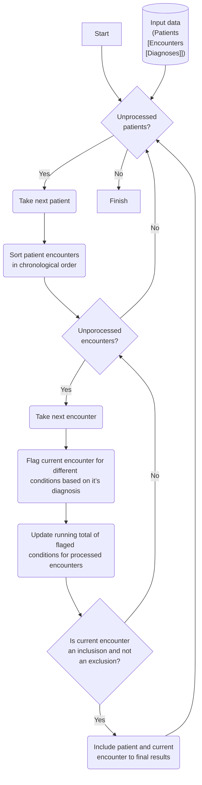

# Nephrotuc syndrom computable phenotype

## Motivation
???

## Reference data

Inclusions and exclusions conditions| $${\color{darkred}Exclude_Encounter}$$ | $${\color{red}Amyloidosis_Encounter}$$ | $${\color{red}Diabetes1_Encounter}$$ | $${\color{red}Diabetes2_Encounter}$$ | $${\color{red}Lupus_Encounter}$$ | $${\color{red}Neph5820_Encounter}$$ | $${\color{red}Neph5829_Encounter}$$ | $${\color{red}Neph5832_Encounter}$$ | $${\color{LightGreen}NSNOS_Encounter}$$ | $${\color{Green}PrimaryNS_Encounter}$$
--- | --- |--- | --- | --- | --- | --- | --- | --- | --- | ---
ICD codes | 583.89, 582.89, 583, V08, 42, 42.1, 42.2, 42.8, 42.9, 70.2, 70.21, 70.22, 70.23, 70.3, 70.31, 70.32, 70.33, 70.41, 70.44, 70.51, 70.54, 70.7, 70.71, 287, 580, 580.4, 593.73, 741.9, 741, 596.54, 277.87, 593.73, 593.7, N05.1, N06.1, N07.1, N03.8, N05.9, Z21, B20, B16.2, B191.1, B160, B18.1, B180, B16.9, B191.0, B161, B18.1, B18.0, B17.11, B18.2, B17.10, B18.2, B19.20, B192.1, D69.0, N00.3, N01.3, N13.729, Q05.8, Q05.4, N31.9, E884.0, E884.1, E884.2, E884.9, H49819, N13.729, N13.70 | 277.39, 277.3, 277.3, E85.1, E853, E858 | E102.9, 250.41, 250.43 | 250.4, 250.43, E08.21, E08.22, E112.9 | M32.10, 710, 710 | 582, N03.2 | N03.9, 582.9 | 583.2, N05.5 | N04.9, 581.9 | 581.1, 581.3, 582.1, 583.1, N02.2, N04.0, N03.3, N05.2


## Algorithm to process one patient
1. Sort patient encounters
2. Process encounters in Chronological order

    2.1 Flag current encounter for different conditions based on it’s diagnosis
    $${\color{red}NEPH5829_Encounter}$$
    $${\color{red}NEPH5829_Encounter}$$
    $${\color{red}NEPH5832_Encounter}$$
    $${\color{red}NEPH5820_Encounter}$$
    $${\color{red}Amyloidosis_Encounter}$$
    $${\color{red}Diabetes2_Encounter}$$
    $${\color{red}Diabetes1_Encounter}$$
    $${\color{red}Lupus_Encounter}$$
    $${\color{Green}PrimaryNS_Encounter}$$
    $${\color{lightgreen}NSNOS_Encounter}$$
    $${\color{darkred}Exclude_Encounter}$$

    2.2 Update running total for flags using previous encounters and the current one 
    $${\color{red}NEPH5829_Total}$$
    $${\color{red}NEPH5832_Total}$$
    $${\color{red}NEPH5820_Total}$$
    $${\color{red}Amyloidosis_Total}$$
    $${\color{red}Diabetes2_Total}$$
    $${\color{red}Diabetes1_Total}$$
    $${\color{red}Lupus_Total}$$
    $${\color{Green}PrimaryNS_Total}$$
    $${\color{lightgreen}NSNOS_Total}$$
    $${\color{darkred}Exclude_Code_Total}$$
    
    2.3 Flag this encounter as a possible inclusion if ${\color{Green}PrimaryNS_Total}$ >1 or ( ${\color{Green}PrimaryNS_Total}$ + ${\color{lightgreen}NSNOS_Total}$ >1 and age <20)
    
    and as possible exclusion if 

    ${\color{red}NEPH5829_Total > 1}$ 
    or ${\color{red}NEPH5832_Total > 1}$ 
    or ${\color{red}NEPH5820_Total > 1}$ 
    or ${\color{red}Amyloidosis_Total > 1}$ 
    or ${\color{red}Diabetes2_Total > 1}$ 
    or ${\color{red}Diabetes1_Total > 1}$ 
    or ${\color{red}Lupus_Total > 1}$ 
    or ${\color{darkred}Exclude_Code_Total > 0}$
    
    2.4. Flag this encounter as "final inclusion" if it is flagged as a "possible inclusion" and is not flagged as a "possible exclusion". 
    
    2.5 If current encounter is flagged as a "final inclusion" then include this patient and this encounter in inclusion list and stop the process. Otherwise if there are more encounters to process, continue with next encounter. If not flagged as final inclusion and this is the last encounter, stop the processing.


## Flowchart 


## Implementation
The algorithm is implemented as a function and is used by two apis that receive data in either json format or as a csv file and process it and return results as HTTP response.

## How to run and test 
Install the app either by running 
```
poetry install 
```
or by installing from a distribution file.

Then, run the app using 
```
uvicorn src.nephroticsyndrome_computablephenotype.apis:app --reload
```

Then you can access fastapi documentation at http://127.0.0.1:8000 to test apis

Use the content of "sample input.txt" for testing the api that consumes data in  json format.

Use the input.csv file to test the api that receives a csv file.
