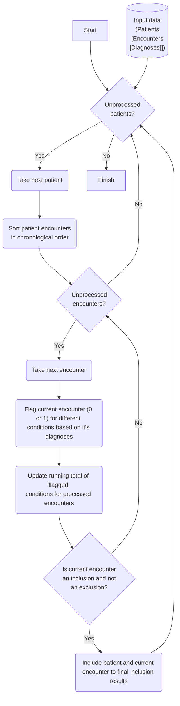

# Nephrotic syndrome computable phenotype
[Knowledge Object Information Page](https://kgrid-lab.github.io/nephroticsyndrome-computablephenotype/src/nephroticsyndrome_computablephenotype/)

[Google Colab Jupyter Notebook Playground](https://colab.research.google.com/drive/1AN4oO3-zEJWU1BUfWqlmQBb5sWN9p5T4?usp=sharing)
## Motivation
Computable phenotypes are algorithms derived from electronic health record (EHR) data that 
classify patients based on the presence or absence of diseases, conditions, or clinical features. 
Computable phenotypes have a wide variety of use cases, including cohort identification for 
clinical trials and observational studies. Phenotyping also plays a role in the collection and 
reporting of real world data to support both clinical investigations and post-market drug or 
device surveillance.

Despite the importance of computable phenotypes to research, patient care, and population 
health, there are no standards for sharing phenotypes, or even for making critical information 
about a phenotype transparent, e.g. in a research publication. This lack of transparency and 
reusability has many serious implications for research and patient care. We study the 
characteristics that make computable phenotypes transparent (such that the impact of feature 
selection decisions can be made explicit), reproducible (such that phenotypes can be used in 
different contexts with similar results), and reusable (such that elements of a phenotype can be 
adapted for use in different contexts or applications).

## Reference data

Inclusions and exclusions conditions| $${\color{darkred}Exclude_Encounter}$$ | $${\color{red}Amyloidosis_Encounter}$$ | $${\color{red}Diabetes1_Encounter}$$ | $${\color{red}Diabetes2_Encounter}$$ | $${\color{red}Lupus_Encounter}$$ | $${\color{red}Neph5820_Encounter}$$ | $${\color{red}Neph5829_Encounter}$$ | $${\color{red}Neph5832_Encounter}$$ | $${\color{LightGreen}NSNOS_Encounter}$$ | $${\color{Green}PrimaryNS_Encounter}$$
--- | --- |--- | --- | --- | --- | --- | --- | --- | --- | ---
ICD codes | 583.89, 582.89, 583, V08, 42, 42.1, 42.2, 42.8, 42.9, 70.2, 70.21, 70.22, 70.23, 70.3, 70.31, 70.32, 70.33, 70.41, 70.44, 70.51, 70.54, 70.7, 70.71, 287, 580, 580.4, 593.73, 741.9, 741, 596.54, 277.87, 593.73, 593.7, N05.1, N06.1, N07.1, N03.8, N05.9, Z21, B20, B16.2, B191.1, B160, B18.1, B180, B16.9, B191.0, B161, B18.1, B18.0, B17.11, B18.2, B17.10, B18.2, B19.20, B192.1, D69.0, N00.3, N01.3, N13.729, Q05.8, Q05.4, N31.9, E884.0, E884.1, E884.2, E884.9, H49819, N13.729, N13.70 | 277.39, 277.3, 277.3, E85.1, E853, E858 | E102.9, 250.41, 250.43 | 250.4, 250.43, E08.21, E08.22, E112.9 | M32.10, 710, 710 | 582, N03.2 | N03.9, 582.9 | 583.2, N05.5 | N04.9, 581.9 | 581.1, 581.3, 582.1, 583.1, N02.2, N04.0, N03.3, N05.2


## Core knowledge used to classifiy patients
1. Sort patient encounters
2. Process encounters in Chronological order

    2.1 Flag current encounter for different conditions based on it’s diagnoses. Each encounter may have multiple diagnoses and each condition listed below may get flagged for multiple diagnoses but the flag is going to be either 0 (for no diagnosis) or 1 (for one or more diagnoses) in that category.

    $${\color{red}NEPH5829_Encounter}$$
    $${\color{red}NEPH5829_Encounter}$$
    $${\color{red}NEPH5832_Encounter}$$
    $${\color{red}NEPH5820_Encounter}$$
    $${\color{red}Amyloidosis_Encounter}$$
    $${\color{red}Diabetes2_Encounter}$$
    $${\color{red}Diabetes1_Encounter}$$
    $${\color{red}Lupus_Encounter}$$
    $${\color{Green}PrimaryNS_Encounter}$$
    $${\color{lightgreen}NSNOS_Encounter}$$
    $${\color{darkred}Exclude_Encounter}$$

    2.2 Update running total for flags using previous encounters and the current one. If a condition was flagged in previous step, this step adds 1 to the running total for that condition. 
    $${\color{red}NEPH5829_Total}$$
    $${\color{red}NEPH5832_Total}$$
    $${\color{red}NEPH5820_Total}$$
    $${\color{red}Amyloidosis_Total}$$
    $${\color{red}Diabetes2_Total}$$
    $${\color{red}Diabetes1_Total}$$
    $${\color{red}Lupus_Total}$$
    $${\color{Green}PrimaryNS_Total}$$
    $${\color{lightgreen}NSNOS_Total}$$
    $${\color{darkred}Exclude_Code_Total}$$
    
    2.3 Flag this encounter as a possible inclusion if ${\color{Green}PrimaryNS_Total}$ >1 or ( ${\color{Green}PrimaryNS_Total}$ + ${\color{lightgreen}NSNOS_Total}$ >1 and age <20)
    
    and as possible exclusion if 

    ${\color{red}NEPH5829_Total > 1}$ 
    or ${\color{red}NEPH5832_Total > 1}$ 
    or ${\color{red}NEPH5820_Total > 1}$ 
    or ${\color{red}Amyloidosis_Total > 1}$ 
    or ${\color{red}Diabetes2_Total > 1}$ 
    or ${\color{red}Diabetes1_Total > 1}$ 
    or ${\color{red}Lupus_Total > 1}$ 
    or ${\color{darkred}Exclude_Code_Total > 0}$
    
    2.4. Flag this encounter as "final inclusion" if it is flagged as a "possible inclusion" and is not flagged as a "possible exclusion". 
    
    2.5 If current encounter is flagged as a "final inclusion" then include this patient and this encounter in inclusion list and stop process next encounters for this patient. Otherwise, if there are more encounters to process, continue with next encounter. If this encounter is not flagged as final inclusion and this is the last encounter, stop the processing for this patient.


## Flowchart 


## Implementation
The algorithm is implemented as a function and is packaged in a knowledge object that includes multiple services to execute it.  Services include
- a stand alone web API: 
    - an API that receives patients data in either Json or a csv file  
    - an API that receives json formatted patients data as the body of the request
- a Command Line Interface (CLI): that receives the patients data as a file 

## Try it out
Use the following link to access this app which is deployed on Heroku: https://nephroticsyndrome-computableph-07c73f0fb31d.herokuapp.com/

 You will see the Open API documentation, click on the "/classification" endpoint and then "Try it out" and follow the instruction to upload and execute the API. Use the test files in the input_test_data folder for testing the API.

## How to install, run and test the app

### Install and run the app from the code 
Clone the repository using
```zsh
git clone https://github.com/kgrid-lab/nephroticsyndrome-computablephenotype.git
```
Install the dependencies and the project
```zsh
poetry install 
```

#### API service
Run the API service using 
```zsh
uvicorn src.nephroticsyndrome_computablephenotype.api:app --reload
```

#### CLI service
Use one of the following approaches to configure and run the CLI:
1. Run the script directly using Python's module option
```zsh
python -m nephroticsyndrome_computablephenotype.cli input_test_data/sample_input.json
```

2. Make the script executable and run directly
```
# Make the script executable on Unix/Linux/macOS:
chmod +x src/nephroticsyndrome_computablephenotype/cli.py 
# Run directly
./src/nephroticsyndrome_computablephenotype/cli.py input_test_data/sample_input.json
```

3. Configure and use it as a command named ***classify*** anywhere from the command line:

Create a symbolic link to cli.py in a directory that is already on your PATH (e.g., /usr/local/bin/) using

```zsh
# On Unix/Linux/macOS:
ln -s /path/to/cli.py /usr/local/bin/classify
```
Note that `/usr/local/bin/` is usually in your PATH. The specific location where you should link your script might vary.

Alternatively You can add an alias in your shell configuration file (like .bashrc or .zshrc):

```zsh
alias classify='/path/to/cli.py'
```
After adding the alias, you may need to reload the shell configuration using source ~/.bashrc or restart your terminal.

call using 
```zsh
# pipe input file to the classify command and redirect the processed output to output.json
cat input_test_data/sample_input.json | classify > output.json

```

### Install and run the app from a distribution file
Install the app using a distribution file
```zsh
pip install https://github.com/kgrid-lab/nephroticsyndrome-computablephenotype/releases/download/1.0.0/nephroticsyndrome_computablephenotype-1.0.0-py3-none-any.whl
```
Then, run the app using 
```zsh
uvicorn nephroticsyndrome_computablephenotype.api:app --reload
```

Once the app is running, you can access fastapi documentation at http://127.0.0.1:8000 to test the API. Use the test files in the input_test_data folder for testing the API.

